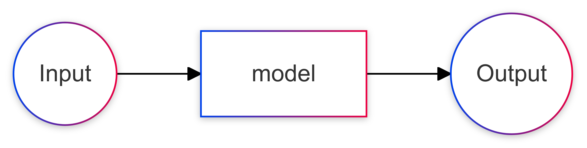
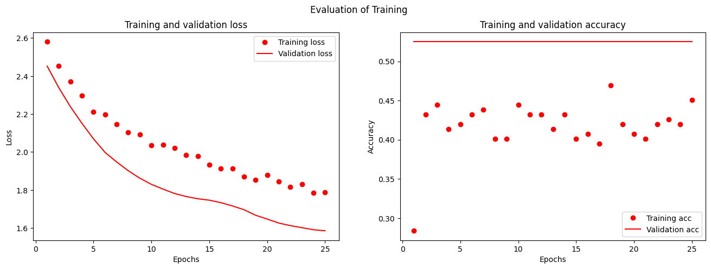
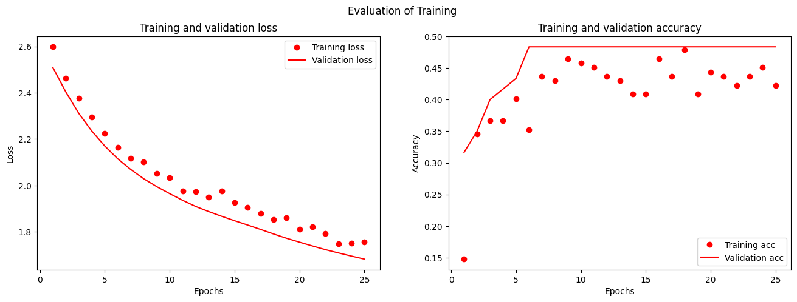
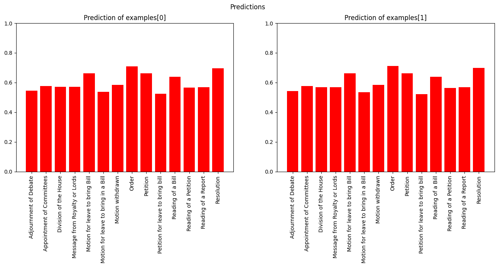

# Kategorisierung von Daten mithilfe von Tensorflow am Beispiel der "House of Commons Journals"

Präsentation im Rahmen der Übung "Digital History" an der Universität Heidelberg, Wintersemester 2024 / 2025

Sebastian Fath

Code und Material verfügbar unter https://github.com/sebastian-fath/dh-parlproc

---
# Gliederung
- Das Projekt
    - Warum?
    - Konsiderationen bei der Datenauswahl
- Exkurs: Tensorflow und Neurale Netzwerke
- Projekt-Ablauf:
    - initiale Datenerstellung
    - Erstellung und Training des Netzwerk
- Analyse und Kennzahlen des Netzwerk
- Revue und Ausblick

---
# Das Projekt
Texte, die im "House of Commons Journal" vorkommen, sollen nach "Art" Kategorisiert werden. 

_Ordered_, That leave be given to bring in a Bill for the better Management of County Rates in England and Wales: And that Mr. Hume and Mr. Alston do prepare, and bring it in.

 

---

# Warum?

- Es ist oft interessanter zu Wissen, wie der Ablauf eines "Vorganges" durch ein Parlament ist, als was an einem bestimmten Tag geschieht.
- Einige Parlamente dokumentieren ihre Abläufe nach Vorgang (e.g. Deutscher Bundestag, vgl. [https://dip.bundestag.de/](https://dip.bundestag.de/)). Leider aber längst nicht alle.
- Aufgrund der schieren Menge Vorgängen vor einem Parlament, ist teilautomatisierte Erstellung von Datensätzen vorteilhaft.
- Kategorisierung von Texten zugehörig der Art des Vorgang als Vorschritt zu einer ausgefleischerteren Lösung für die teilautomatisierte Erstellung von "vorgangs-orientierten" Datensätzen.
- Kategorisierung von Text in Daten ist nützlich (auch in anderen Vorhaben), e.g. "tagging", etc.

---

# Konsiderationen bei der Datenauswahl

- Verfügbarkeit - die HoC Journals sind einfach [online](https://www.parliament.uk/business/publications/commons/house-of-commons-journal/) verfügbar. 
- Datenmenge - HoC hat genügend viele Journals veröffentlicht, um die erstellung von grpß genügenden Datensätzen zu ermöglichen.
- Einheitlichkeit - Format vor 1950 weitesgehend einheitlich.
- Automatisierbarkeit - sowohl OCR als auch NLP et al. können mit englischen Texten vergleichsweise gut (bzw. besser) umgehen.

---

# Exkurs: Tensorflow und Neuronale Netze
Was steckt hinter der Kategorisierung?

---

# Was sind neuronale Netze? / Das Ziel
In diesem Fall

Input: "Text"

Output: Liste an Wahrscheinlichkeiten


---
<!-- footer: "Image credit: Google, veröffentlicht unter Public Domain [wikipedia.org/wiki/TensorFlow](https://wikipedia.org/wiki/TensorFlow#/media/File:TensorFlow_logo.svg)" -->

# Tensorflow
"library", ermöglicht einfaches implementieren von Neuronalen Netzwerken in python.

Ursprünglich geschrieben in C, API verfügbar in Python und Javascript

Steckkastenprinzip


---
<!-- footer: "" -->

# Projekt-Ablauf
- initiale Datenerstellung
- Erstellung des Netzwerk
- Training des Netwerk
- Analyse und Kennzahlen des Netzwerk

---
<!-- footer: "[1]: Vgl. Yusu Qian, Haotian Zhang, Yinfei Yang and Zhe Gan. “How Easy is It to Fool Your Multimodal LLMs? An Empirical Analysis on Deceptive Prompts.” ArXiv abs/2402.13220 (2024)" -->
# Projekt-Ablauf: initiale Datenerhebung
- Erstellung eines neuronalen Netzwerk braucht anfänglich Daten, um Machine Learning zu betreiben
- Erstellung von anfänglichen Daten ist zeitintensiv.
  - Lösung 1: andere machen lassen
  - Lösung 2: wenig Daten selbst, dann GPT-AI (im hiesigen Fall Chat-GPT o1) erweitern lassen. ABER: Problem der Halluzination [1]

- *Lösung 1 war nicht möglich, also Lösung 2*
  - Resultat nach 1,5 Stunden am Prompt rumspielen: ~ 200 nutzbare Dateneinträge. Danach gab auch o1 auf.

---
<!-- footer: "" -->
# Erstellung Schritt 0 - Daten laden

```python
import pandas as pd
from pathlib import Path
import matplotlib.pyplot as plt

data = pd.read_csv(file, delimiter='|')
```

---

# Erstellung Schritt 0 - Daten laden
```
	journal_num	text	                                    class
0	92	A Bill for the more effectual preventing Cland...	Reading of a Bill
1	92	PETITION of several Persons whose names are th...	Petition for leave to bring bill
2	92	Sir John Beckett presented a Bill for inclosin...	Reading of a Bill
3	92	Lord Russell presented a Bill for inclosing an...	Reading of a Bill
4	92	A Petition of Hand-loom Weavers of Longtown, p...	Reading of a Petition
...	...	...	...
195	146	Resolved, That if \n it \n shall appear that a...	Resolution
196	146	Resolved, That if it \n shall appear that any ...	Resolution
197	146	Resolved, That an humble Address be pre- Qwen'...	Resolution
198	146	Ordered, That all Members who are returned \n ...	Order
199	146	Ordered, That the Commissioners of the Police ...	Order
200 rows × 3 columns
```

---

# Erstellung Schritt 1 - Daten in geeignetes Format

Für Training und verarbeitung von Daten kann Tensorflow Daten direkt aus pandas DataFrame lesen; allerdings bietet sich die Erstellung eines Korpus hier an in einem Ordner mit folgender Struktur:

```
-- data/
 |-- class1/
 | |-- 1.txt
 | |-- 2.txt
 |-- class2/
...
```
---

# Erstellung Schritt 1 - Daten in geeignetes Format

```python
class_names = data["class"].unique()

for class_name in class_names:
    class_dir = Path(f"data/dataset/{class_name}")
    class_dir.mkdir(parents=True, exist_ok=True)

# write data to disk
for index, row in data.iterrows():
    print(index, row)
    with open(f"data/dataset/{row["class"]}/{index}.txt", "w") as f:
        f.write(row[1])
```

---

# Erstellung Schritt 1 - Daten in geeignetes Format

```bash
$ ls -l data/dataset
total 0
drwxr-xr-x 1 sebastianfath sebastianfath   24 Jan 25 05:15 'Adjournment of Debate'
drwxr-xr-x 1 sebastianfath sebastianfath   24 Jan 25 05:15 'Appointment of Committees'
drwxr-xr-x 1 sebastianfath sebastianfath   38 Jan 25 05:16 'Division of the House'
drwxr-xr-x 1 sebastianfath sebastianfath  118 Jan 25 05:16 'Message from Royalty or Lords'
drwxr-xr-x 1 sebastianfath sebastianfath  172 Jan 25 05:16 'Motion for leave to bring Bill'
drwxr-xr-x 1 sebastianfath sebastianfath   24 Jan 25 05:15 'Motion for leave to bring in a Bill'
drwxr-xr-x 1 sebastianfath sebastianfath   24 Jan 25 05:15 'Motion withdrawn'
drwxr-xr-x 1 sebastianfath sebastianfath 1206 Jan 25 05:16  Order
drwxr-xr-x 1 sebastianfath sebastianfath  268 Jan 25 05:16  Petition
drwxr-xr-x 1 sebastianfath sebastianfath   10 Jan 25 05:15 'Petition for leave to bring bill'
drwxr-xr-x 1 sebastianfath sebastianfath   54 Jan 25 05:15 'Reading of a Bill'
drwxr-xr-x 1 sebastianfath sebastianfath   20 Jan 25 05:15 'Reading of a Petition'
drwxr-xr-x 1 sebastianfath sebastianfath   10 Jan 25 05:15 'Reading of a Report'
drwxr-xr-x 1 sebastianfath sebastianfath  612 Jan 25 05:16  Resolution
```

---

# Erstellung Schritt 2 - Daten laden

aus dem Entstandenen Ordner kann man nun sehr einfach mithilfe von `tensorflow.keras.utils.text_dataset_from_directory()` die Daten geeignet für tensorflow laden.

```python
import tensorflow as tf

seed = 101
tf_train_data = tf.keras.utils.text_dataset_from_directory(
  "data/dataset", batch_size=32, validation_split=0.2, subset='training', seed=seed)
tf_val_data = tf.keras.utils.text_dataset_from_directory(
  "data/dataset", batch_size=32, validation_split=0.2, subset='validation', seed=seed)
```

---
<!-- footer: "[1]: Zumindest seit Tomas Mikolov, Kai Chen, Gregory S. Corrado and Jeffrey Dean. “Efficient Estimation of Word Representations in Vector Space.” International Conference on Learning Representations (2013), [arXiv:1301.3781](https://arxiv.org/abs/1301.3781v3)." -->
# Erstellung Schritt 3 - Vectorisation

Computer, und insbesondere neurale Netze sind schlecht darin Wörter zu verstehen. Dementsprechend braucht es für neuronale Netzwerke die Konvertierung von Wort in ein Format, was aussagen treffen kann über die Bedeutung (Semantik) von Wörtern.

Wörter werden dabei meist dargestellt als n-Dimensionale Vektoren. [1]

---
<!-- footer: "" -->
# Erstellung Schritt 3 - Vectorisation


```python
max_features = 1000
sequence_length = 250
def custom_standardization(input_data):
  lowercase = tf.strings.lower(input_data)
  stripped_html = tf.strings.regex_replace(lowercase, '\\n', ' ')
  return tf.strings.regex_replace(stripped_html,
                                  '[%s]' % re.escape(string.punctuation),
                                  '')

vectorize_layer = tf.keras.layers.TextVectorization(
        standardize=custom_standardization,
        max_tokens=max_features,
        output_mode='int',
        output_sequence_length=sequence_length
        )
# Make a text-only dataset (without labels), then call adapt
train_text = tf_train_data.map(lambda x, y: x)
vectorize_layer.adapt(train_text)
```

---

# Erstellung Schritt 3 - Vectorisation
Im letzten Schritt vor dem Training Vectorisieren wir unsere Trainingsdaten mithilfe der erstellten `vectorize_layer`

```python
def vectorize_text(text, label):
  text = tf.expand_dims(text, -1)
  return vectorize_layer(text), label

train_data = tf_train_data.map(vectorize_text)
val_data = tf_val_data.map(vectorize_text)
```

---

# kurzer Exkurs: Vectorisation

```python
text_batch, label_batch = next(iter(tf_train_data))
first_review, first_label = text_batch[0], label_batch[0]
print("Text", first_review)
print("Class", tf_train_data.class_names[first_label])
print("Vectorized Text", vectorize_text(first_review, first_label))
```

---

```
Text tf.Tensor(b'Ordered, That the Commissioners of the Police \\n  
of the Metropolis do take care that, during the \\n 
Session of Parliament, the passages through the \\n  
streets leading to this House be kept free and \\n 
open, and that no obstruction be permitted to \\n  
hinder the passage of Members to and from this \\n  
House, and that no \\n 
disorder be allowed in \\n Westminster Hall, or in the \\n passages leading to \\n 
this House, during the sitting of Parliament,', 
shape=(), dtype=string)
Class Order
Vectorized Text (<tf.Tensor: shape=(1, 500), dtype=int64, numpy=
array([[ 15,   8,   3, 192,   4,   3, 201,   2,   4,   3, 390,  19, 127,
        218,   8,  96,   3,   2,  87,   4,  31,   3, 202, 298,   3,   2,
        317, 228,   6,  18,  14,  12, 393, 395,   5,   2, 274,   5,   8,
         26, 594,  12, 387,   6,   2, 240,   3, 434,   4,  54,   6,   5,
         40,  18,   2,  14,   5,   8,  26,   2, 736,  12, 750,   7,   2,
        180, 297,  13,   7,   3,   2, 202, 228,   6,   2,  18,  14,  96,
          3, 172,   4,  31,   0,   0,   0,   0,   0,   0,   0,   0,   0,
          0,   0,   0,   0,   0,   0,   0,   0,   0,   0,   0,   0,   0,

...
          0,   0,   0,   0,   0,   0,   0,   0,   0,   0,   0,   0,   0,
          0,   0,   0,   0,   0,   0,   0,   0,   0,   0,   0,   0,   0,
          0,   0,   0,   0,   0,   0,   0,   0,   0,   0,   0,   0,   0,
          0,   0,   0,   0,   0,   0]])>, <tf.Tensor: shape=(), dtype=int32, numpy=7>)
```

---
# Erstellung Schritt 4 - Training

```python
def init_model(output_amount: int, max_features: int = 100000, embedding_dim: int = 16):
    # model contains different preconfigured layers from tensorflow.keras; 
    # init model largely adapted from tensorflow.org/tutorials/keras/text_classification
    model = tf.keras.Sequential([
        layers.Embedding(max_features, embedding_dim),
        layers.Dropout(0.2),
        layers.GlobalAveragePooling1D(),
        layers.Dropout(0.2),
        layers.Dense(output_amount, activation='sigmoid')
    ])
    model.compile(
        loss = losses.SparseCategoricalCrossentropy(from_logits=True),
        optimizer = 'adam',
        metrics = ['accuracy']
    )
    return model

model_init = init_model(output_amount=len(class_names))

model_init.summary()
```
---
# Erstellung Schritt 4 - Training
```
Model: "sequential"
┏━━━━━━━━━━━━━━━━━━━━━━━━━━━━━━━━━┳━━━━━━━━━━━━━━━━━━━━━━━━┳━━━━━━━━━━━━━━━┓
┃ Layer (type)                    ┃ Output Shape           ┃       Param # ┃
┡━━━━━━━━━━━━━━━━━━━━━━━━━━━━━━━━━╇━━━━━━━━━━━━━━━━━━━━━━━━╇━━━━━━━━━━━━━━━┩
│ embedding (Embedding)           │ ?                      │   0 (unbuilt) │
├─────────────────────────────────┼────────────────────────┼───────────────┤
│ dropout (Dropout)               │ ?                      │             0 │
├─────────────────────────────────┼────────────────────────┼───────────────┤
│ global_average_pooling1d        │ ?                      │             0 │
│ (GlobalAveragePooling1D)        │                        │               │
├─────────────────────────────────┼────────────────────────┼───────────────┤
│ dropout_1 (Dropout)             │ ?                      │             0 │
├─────────────────────────────────┼────────────────────────┼───────────────┤
│ dense (Dense)                   │ ?                      │   0 (unbuilt) │
└─────────────────────────────────┴────────────────────────┴───────────────┘
Total params: 0 (0.00 B)
Trainable params: 0 (0.00 B)
Non-trainable params: 0 (0.00 B)
```

---

# Erstellung Schritt 4 - Training

```python
def train_model(model, training_data, validation_data, epochs: int = 20):
    history = model.fit(training_data, validation_data=validation_data, epochs=epochs)
    return model, history

model, history = train_model(model_init, train_data, val_data, epochs=12)

model.summary()
```

---

# Erstellung Schritt 4 - Training

```
Epoch 1/12
6/6 ━━━━━━━━━━━━━━━━━━━━ 1s 32ms/step - accuracy: 0.2702 - loss: 2.6107 - val_accuracy: 0.5250 - val_loss: 2.4490
Epoch 2/12
6/6 ━━━━━━━━━━━━━━━━━━━━ 0s 20ms/step - accuracy: 0.4461 - loss: 2.4714 - val_accuracy: 0.5250 - val_loss: 2.3052
Epoch 3/12
6/6 ━━━━━━━━━━━━━━━━━━━━ 0s 20ms/step - accuracy: 0.4304 - loss: 2.3988 - val_accuracy: 0.5250 - val_loss: 2.1914
Epoch 4/12
6/6 ━━━━━━━━━━━━━━━━━━━━ 0s 19ms/step - accuracy: 0.4292 - loss: 2.3201 - val_accuracy: 0.5250 - val_loss: 2.1211
Epoch 5/12
6/6 ━━━━━━━━━━━━━━━━━━━━ 0s 20ms/step - accuracy: 0.4470 - loss: 2.2979 - val_accuracy: 0.5250 - val_loss: 2.0701
Epoch 6/12
6/6 ━━━━━━━━━━━━━━━━━━━━ 0s 20ms/step - accuracy: 0.4546 - loss: 2.2238 - val_accuracy: 0.5250 - val_loss: 2.0204
Epoch 7/12
6/6 ━━━━━━━━━━━━━━━━━━━━ 0s 20ms/step - accuracy: 0.4414 - loss: 2.1562 - val_accuracy: 0.5250 - val_loss: 1.9833
Epoch 8/12
6/6 ━━━━━━━━━━━━━━━━━━━━ 0s 21ms/step - accuracy: 0.4109 - loss: 2.1627 - val_accuracy: 0.5250 - val_loss: 1.9443
Epoch 9/12
6/6 ━━━━━━━━━━━━━━━━━━━━ 0s 19ms/step - accuracy: 0.4387 - loss: 2.1167 - val_accuracy: 0.5250 - val_loss: 1.9041
Epoch 10/12
6/6 ━━━━━━━━━━━━━━━━━━━━ 0s 19ms/step - accuracy: 0.4775 - loss: 2.0303 - val_accuracy: 0.5250 - val_loss: 1.8655
Epoch 11/12
6/6 ━━━━━━━━━━━━━━━━━━━━ 0s 20ms/step - accuracy: 0.4321 - loss: 2.0725 - val_accuracy: 0.5250 - val_loss: 1.8337
Epoch 12/12
6/6 ━━━━━━━━━━━━━━━━━━━━ 0s 19ms/step - accuracy: 0.4308 - loss: 2.0287 - val_accuracy: 0.5250 - val_loss: 1.8037
```

---

# Erstellung Schritt 4 - Training

```
Model: "sequential"
┏━━━━━━━━━━━━━━━━━━━━━━━━━━━━━━━━━┳━━━━━━━━━━━━━━━━━━━━━━━━┳━━━━━━━━━━━━━━━┓
┃ Layer (type)                    ┃ Output Shape           ┃       Param # ┃
┡━━━━━━━━━━━━━━━━━━━━━━━━━━━━━━━━━╇━━━━━━━━━━━━━━━━━━━━━━━━╇━━━━━━━━━━━━━━━┩
│ embedding (Embedding)           │ (None, None, 16)       │     1,600,000 │
├─────────────────────────────────┼────────────────────────┼───────────────┤
│ dropout (Dropout)               │ (None, None, 16)       │             0 │
├─────────────────────────────────┼────────────────────────┼───────────────┤
│ global_average_pooling1d        │ (None, 16)             │             0 │
│ (GlobalAveragePooling1D)        │                        │               │
├─────────────────────────────────┼────────────────────────┼───────────────┤
│ dropout_1 (Dropout)             │ (None, 16)             │             0 │
├─────────────────────────────────┼────────────────────────┼───────────────┤
│ dense (Dense)                   │ (None, 13)             │           221 │
└─────────────────────────────────┴────────────────────────┴───────────────┘
 Total params: 4,800,665 (18.31 MB)
 Trainable params: 1,600,221 (6.10 MB)
 Non-trainable params: 0 (0.00 B)
 Optimizer params: 3,200,444 (12.21 MB)
 ```

 ---

# Analyse und Kennzahlen des Models (80/20 split)

```
{'accuracy': 0.4382716119289398, 'loss': 2.350292921066284}
```

- accuracy: "Calculates how often predictions equal labels."
  - correct prediction / all predictions in Test-datensatz
- loss: bezieht "distanz" zwischen Vorhersage und tatsächlichem Ergebnis mit ins Erghebnis ein.

---

# Analyse des Training (80/20 split)



---

# Analyse des Training (70/30 split)


`{'accuracy': 0.44366195797920227, 'loss': 2.3417766094207764}`

---

# Verwendungs-Beispiele

```python
examples = tf.constant([
    """Ordered, That no Bills, other than Government Bills, 
    be introduced in anticipation of the Ballot, and that all 
    Members who desire to ballot, whether for Bills or for Motions for
    Wednesdays the 30th November, 7th, 14th, and 21st December, do hand in
    their names at the Table during the Sitting of the House on Tuesday 
    22nd November or Wednesday 23rd November; and that a copy of the notice 
    of such Bill or Motion be handed in at the latest during the Sitting of 
    the House on Thursday the 24th November. """,
    """Colonel Sir Walter Smiles, supported by Colonel Sir Kenyan, 
    Vaughan-Morgan, Captain Bill Elliston, Mr. Rosbotham, Mr. Richard 
    Russell, Sir Walter Greaves-Lord, Miss Horsbrugh, Mr. Buchan, Mr. 
    Alexander Ramsay, and Mr. Cocks, presented a Bill to provide for the 
    licensing of Dog-racing courses: And the same was ordered to be read a 
    second time upon Friday next; and to be printed"""
])

model.predict(examples)
```

--- 

# Verwendungs-Beispiele


---

# Revue und Ausblick

- Treffsicherheit von > 40 % nicht gut, aber bei 13 Klassen auch nicht unbedingt schlecht
- Differenz zwischen Vorhersagen existent, aber nicht sonderlich ausschlaggebend
  - wahrscheinlich "underfit"
- **funktion wahrscheinlich noch nicht erreicht**
- Grundsätzlich aber auch nach Dezimierung des Datensatz kein nennenswerter Unterschied in Akkuranz
  - Argument dafür, dass Funktion vorhanden ist

---

# Revue und Ausblick

- Aber:
  - viel potential nach oben, vor allem durch Erstellung von mehr handgeschriebenen Daten
  - möglichkeit der Implementierung von "Safeguards" gegen Underfit/Overfit
- Verwendung von GPT o1 zur Ausweitung des Datensatz funktioniert; ist aber möglicherweise nicht Ideal für Qualität

- **Grundsätzlich ist Kategorisierung mithilfe von ML möglich (und funktioniert so wie hier auch); dies benötigt allerdings einen signifikanten Zeitaufwand an vorheriger händischer Datenerhebung**

---

# Daten-Quelle

https://www.parliament.uk/business/publications/commons/house-of-commons-journal/

# Source-Code

https://github.com/sebastian-fath/dh-parlproc